# ⚡ Graphify Codebase Knowledge Graph & Architecture Report

> **Repository:** Personal Finance & Wealth Tracker (Version 1.1)  
> **Generated:** 26/9/2026, 12:27:31 pm  
> **Total Nodes:** 64  
> **Total Dependency Edges:** 205

---

## 🏛️ High-Level Architecture Overview

```mermaid
flowchart TD
  subgraph ClientApp ["Frontend (React 18 + Vite)"]
    App["App.jsx (Router)"]
    Dashboard["Dashboard.jsx"]
    MF["MutualFunds.jsx (AMFI + Groww)"]
    NetWorth["NetWorth.jsx"]
    Goals["Goals.jsx"]
    Budgets["Budgets.jsx"]
    Txns["Transactions.jsx"]
    SIPs["SIPs.jsx"]
    Past["PastExpenses.jsx"]
    Reports["Reports.jsx"]
  end

  subgraph StateAndUtils ["Context & Intelligence Engines"]
    AuthContext["AuthContext.jsx"]
    AdminContext["AdminContext.jsx"]
    MFApi["mfApi.js (Live AMFI NAVs)"]
    GrowwParser["growwParser.js"]
    StatementParser["statementParser.js"]
  end

  subgraph SupabaseDB ["Supabase Cloud Database (PostgreSQL)"]
    tbl_users[("auth.users")]
    tbl_txns[("transactions")]
    tbl_mfs[("mutual_funds")]
    tbl_sips[("sips")]
    tbl_debts[("debts")]
    tbl_goals[("goals")]
    tbl_budgets[("budgets")]
    tbl_assets[("net_worth_custom_assets")]
    tbl_cats[("categories")]
    tbl_pms[("payment_methods")]
  end

  App --> Dashboard & MF & NetWorth & Goals & Budgets & Txns & SIPs & Past & Reports
  Dashboard --> MFApi & tbl_txns & tbl_mfs & tbl_debts
  MF --> MFApi & GrowwParser & tbl_mfs
  NetWorth --> tbl_mfs & tbl_assets & tbl_debts
  Goals --> tbl_goals & tbl_sips
  Budgets --> tbl_budgets & tbl_txns & tbl_cats
  Txns --> StatementParser & tbl_txns & tbl_cats & tbl_pms
```

---

## 📊 Modules & Node Breakdown

| Group | Node Count | Key Modules / Tables |
|---|---|---|
| **Pages & Routes** | 12 | `Dashboard`, `MutualFunds`, `NetWorth`, `Goals`, `Budgets`, `Transactions`, `SIPs`, `PastExpenses`, `Reports` |
| **UI Components** | 23 | `GrowwPortfolioGrowthChart`, `PortfolioHealthModal`, `StatementImportModal`, `Layout`, `Sidebar`, `TransactionForm` |
| **Context Providers** | 3 | `AuthContext`, `AdminContext` |
| **Core Utilities** | 8 | `mfApi.js` (AMFI), `growwParser.js`, `statementParser.js`, `formatCurrency.js`, `dateUtils.js` |
| **Database Tables** | 11 | `mutual_funds`, `transactions`, `sips`, `debts`, `goals`, `budgets`, `net_worth_custom_assets` |

---

## 🎯 Top Centrality Hubs (Highest Impact / Connections)

1. **AuthContext** (Context Providers) — `19 direct connections`
2. **App** (Utils) — `18 direct connections`
3. **SIPs** (Pages & Routes) — `18 direct connections`
4. **Layout** (UI Components) — `17 direct connections`
5. **Dashboard** (Pages & Routes) — `16 direct connections`
6. **formatCurrency** (Core Utilities) — `16 direct connections`
7. **DataBackupModal** (UI Components) — `15 direct connections`
8. **supabaseClient** (Clients & Config) — `15 direct connections`
9. **MutualFunds** (Pages & Routes) — `15 direct connections`
10. **Transactions** (Pages & Routes) — `15 direct connections`

---

## 📂 Output Files Generated in `graphify/` and `graphifyy/`:
- **`graph.html`**: Interactive drag-and-drop 2D physics graph visualization.
- **`graph.json`**: Raw parsed graph AST & relation graph dataset.
- **`CODEBASE_GRAPH.md`**: Architecture index and Mermaid diagram.
